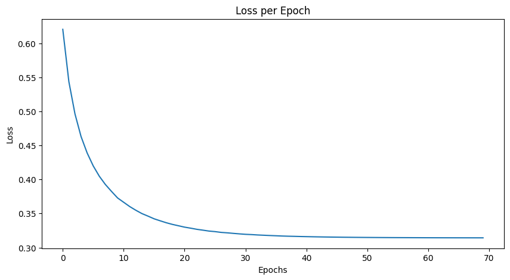
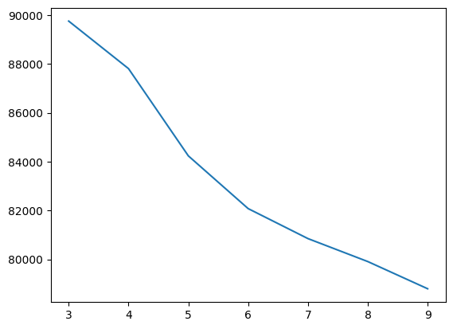

# Abusive Swearing Detection w/ Logistic Regression
Usage: `logistic.py [-h] [--train TRAIN] [--test TEST] [--punctuation PUNC]
                    [--stopwords STOPWORDS] [-o OUTPUT] [-lr LR]
                    [--epochs EPOCHS] [--tol TOL] [-v]`

Runs the TF-IDF Algorithm on the given text input and uses the TF-IDF vector in a Logistic
Regression algorithm to detect abusive speech. Program will output the accuracy score on the train and test set to STDOUT
and the loss/epoch to a given output path.

Optional Arguments:
```
  -h, --help            show this help message and exit
  --train TRAIN         Path to the training data (CSV File) (default:
                        data/swad_train.csv)
  --test TEST           Path to the training data (CSV File) (default:
                        data/swad_test.csv)
  --punctuation PUNC    Path to punctuation text file (default:
                        data/punctuations.txt)
  --stopwords STOPWORDS
                        Path to the stopwords text file (default:
                        data/stopwords.txt)
  -o OUTPUT, --output OUTPUT
                        Where the elbow diagram should be written (default:
                        outputs/loss.png)
  -lr LR, --learning-rate LR
                        The learning rate for the logisitc regression model
                        (default: 0.1)
  --epochs EPOCHS       The number of epochs to run (default: 100)
  --tol TOL             Tolerance for model convergence (default: 1e-05)
  -v, --verbose         Whether to print out verbose training message
                        (default: False)
```

Example:

```
python logistic.py -v
Loss at epoch 0: 0.6205461900625342
Loss at epoch 1: 0.5436356851371281
...
Loss at epoch 67: 0.3142726290748519
Loss at epoch 68: 0.31426198074528805
Loss at epoch 69: 0.31425238746833006
Model converged at epoch 69
Train Accuracy: 0.9144608526051825
Test Accuracy : 0.842
```

Loss Example: 



# K-Means Clustering

Usage: `kmeans.py [-h] [-p PATH] [-s START] [-e END] [-o OUTPUT] [-a {++,random}] [-r RANDOM_STATE] [-d {euclidean,manhattan}]`

Runs the KMeans Algorithm over a range of numbers on a given input. Will
output the elbow diagram by calculating the dispersion over the range of K

Optional Arguments:

```
  -h, --help            show this help message and exit
  -p PATH, --path PATH  Path to the input file (must be a CSV) (default:
                        data/income.csv)
  -s START, --start START
                        The start range for the K search (cannot be less than
                        1) (default: 1)
  -e END, --end END     The end range for the K search (default: 8)
  -o OUTPUT, --output OUTPUT
                        Where the elbow diagram should be written (default:
                        outputs/elbow.png)
  -a {++,random}, --alg {++,random}
                        The algorithm to use for centroid initialization
                        (default: ++)
  -r RANDOM_STATE, --random-state RANDOM_STATE
                        The random state (used for reproducability) (default:
                        0)
  -d {euclidean,manhattan}, --dist {euclidean,manhattan}
                        Which distance algorithm to use for clustering
                        (default: euclidean)
```

Example:

```
❯ python kmeans.py
[1 / 8] <KMeansCluster(k=1, strategy=++, distance=euclidean, tolerance=0.0001, random_state=0)> Score - 98747.44014120326
[2 / 8] <KMeansCluster(k=2, strategy=++, distance=euclidean, tolerance=0.0001, random_state=0)> Score - 93029.19148009528
[3 / 8] <KMeansCluster(k=3, strategy=++, distance=euclidean, tolerance=0.0001, random_state=0)> Score - 89752.56270272209
[4 / 8] <KMeansCluster(k=4, strategy=++, distance=euclidean, tolerance=0.0001, random_state=0)> Score - 87806.84500684115
[5 / 8] <KMeansCluster(k=5, strategy=++, distance=euclidean, tolerance=0.0001, random_state=0)> Score - 84236.06875850202
[6 / 8] <KMeansCluster(k=6, strategy=++, distance=euclidean, tolerance=0.0001, random_state=0)> Score - 82079.79300132814
[7 / 8] <KMeansCluster(k=7, strategy=++, distance=euclidean, tolerance=0.0001, random_state=0)> Score - 80849.07649275656
[8 / 8] <KMeansCluster(k=8, strategy=++, distance=euclidean, tolerance=0.0001, random_state=0)> Score - 79633.89198193325
```

# Experiment Results

### Abusive Language Detection w/ Logistic Regression

- Final Train Accuracy for `swad_train.py`: 0.9144608526051825
- Final Test Accuracy for `swad_test.py`: 0.842

### K-Means Clustering

- Final K: 6
- Final Elbow Results:


