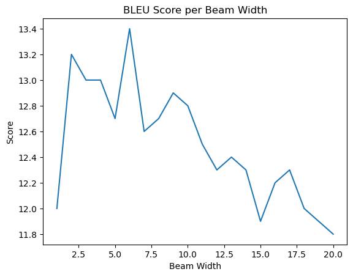

# Question 1: NYC Taxi Data

File: `taxi.py`

### Description
Creates an adjacency matrix based on Taxi data, and calculates and reports the shortest path to a given destination using the given
algorithm. The algorithms supported are A* (AStar) and Uniform Cost Search (UCS). The file also gives you the ability to save the output.

### Usage
```
>>> python taxi.py -h
usage: taxi.py [-h] [-p PATH] [-s START] [-d DESTINATION] [-a {UCS,AStar}] [--save] [-o OUTPUT]

Creates an adjacency matrix based on Taxi data, and calculates and reports the shortest path to a given destination using the given
algorithm.

optional arguments:
  -h, --help            show this help message and exit
  -p PATH, --path PATH  The path to the Taxi data (default: nyc_taxi_data.csv)
  -s START, --start START
                        The ID of the start node (default: 0)
  -d DESTINATION, --dest DESTINATION
                        The ID of the destination node (default: 1)
  -a {UCS,AStar}, --alg {UCS,AStar}
                        The algorithm to use to calculate the path. Either Uniform Cost Search (UCS) or A* (a*) (default: UCS)
  --save                Write the graph to disk. Must specify '--output' if set (default: False)
  -o OUTPUT, --output OUTPUT
                        The directory to output the graphs nodes and edges. (default: None)
```

### Examples

#### 926 -> 35656

**UCS**

```
>>> python taxi.py -p nyc_taxi_data.csv -o outputs/ --save -s 926 -d 35656 -a UCS  
Graph Build Time: 5.294153690338135s
Path: Node(926) --18.5--> Node(113058) --0.73--> Node(96887) --2.6--> Node(35656)
Total Cost of Path: 21.83
Total Time Taken: 1.7784s
```

**AStar**
```
>>> python taxi.py -p nyc_taxi_data.csv -o outputs/ --save -s 926 -d 35656 -a AStar
Graph Build Time: 5.23990535736084s
Path: Node(926) --18.5--> Node(113058) --0.73--> Node(96887) --2.6--> Node(35656)
Total Cost of Path: 21.83
Total Time Taken: 0.4548s
```

#### 926 -> 98341

**UCS**

```
>>> python taxi.py -p nyc_taxi_data.csv -s 926 -d 98341 -a UCS  
Graph Build Time: 4.466918230056763s
Path: Node(926) --16.79--> Node(65831) --1.66--> Node(96806) --1.83--> Node(126256) --0.4--> Node(121171) --1.4--> Node(97565) --1.0--> Node(107926) --0.4--> Node(98341)
Total Cost of Path: 23.48
Total Time Taken: 30.2707s
```

**AStar**

```
>>> python taxi.py -p nyc_taxi_data.csv -s 926 -d 98341 -a AStar 
Graph Build Time: 4.512512445449829s
Path: Node(926) --16.79--> Node(65831) --1.66--> Node(96806) --1.83--> Node(126256) --0.4--> Node(121171) --1.4--> Node(97565) --1.0--> Node(107926) --0.4--> Node(98341)
Total Cost of Path: 23.48
Total Time Taken: 3.7718s
```

# Question 2: Neural Machine Translation

### Description

Runs the beam search algorithm on the specified input data. Code must be modified in order to make it perform on different data. As of right now, it is configured to perform the following:

- Source Sentences: `data/test.fra`
- Target Sentences: `data/test.eng`
- Beam Width: 6

### Greedy Search: Test Data BLEU Score 

Score: 12.6

```
{
 "name": "BLEU",
 "score": 12.6,
 "signature": "nrefs:1|case:mixed|eff:no|tok:13a|smooth:exp|version:2.0.0",
 "verbose_score": "41.4/13.5/7.9/5.6 (BP = 1.000 ratio = 1.036 hyp_len = 6441 ref_len = 6218)",
 "nrefs": "1",
 "case": "mixed",
 "eff": "no",
 "tok": "13a",
 "smooth": "exp",
 "version": "2.0.0"
}
```

### Beam Search: Validation Data Plot

Best Score: 13.4

Beam Width: 6



### Beam Search: Test Data BLEU Score

Score: 13.3

```
{
 "name": "BLEU",
 "score": 13.3,
 "signature": "nrefs:1|case:mixed|eff:no|tok:13a|smooth:exp|version:2.0.0",
 "verbose_score": "43.7/14.9/9.3/6.8 (BP = 0.934 ratio = 0.936 hyp_len = 5820 ref_len = 6218)",
 "nrefs": "1",
 "case": "mixed",
 "eff": "no",
 "tok": "13a",
 "smooth": "exp",
 "version": "2.0.0"
}
```

### Note

There is a file `plot.py`. If you run this file, it will crash due to lack of data. You can reconfigure `beam_search.py` to run on beams 1-20 and output the appropriate files. Then run plot to generate a new validation plot. 

Results may vary.
